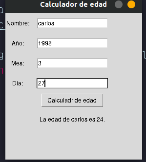

# 50 python projects challenges

In this repository you'll find a collection of 50 Python projects challenges, each one with a different goal and getting harder to solve

---

## 1.Age Calculator

>This is a simple program made by me, is the first from my 50 projects that i'm making.

in this age calculator app,users can type their date of birth and the app will display their age.

1. First I imported the datetime module to get the current date, and tkinter to create the GUI.

2. I create a simple window 

3. and then I create a function to do all the algorithm

4. date,year and month are the values that the user will type in the text boxes so they are global variables and can be used in the function.

5. To make this work, just type ``` python3 age_calculator.py ``` in the terminal.


---